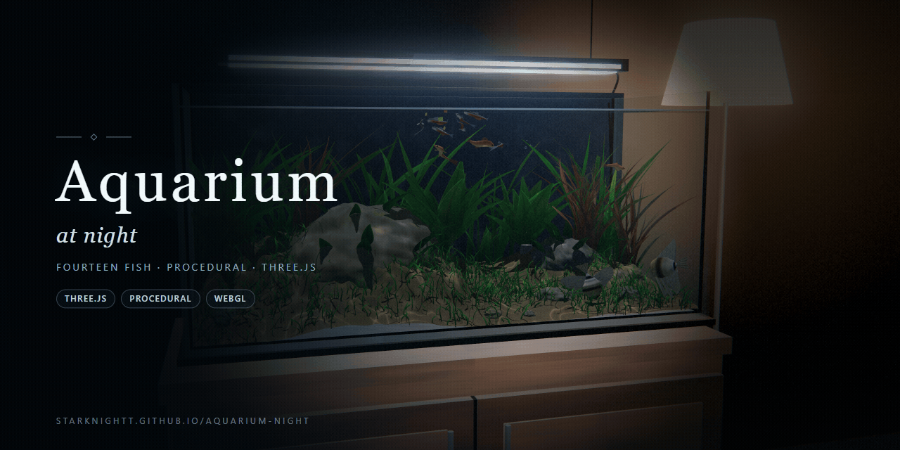

# Aquarium at night

A night home aquarium in a dark room, built in Three.js. The tank sits on a
wooden cabinet under a thin LED bar; a floor lamp glows warm off to the side.
Fourteen fish school, graze and scatter when you tap the glass. Everything on
screen and everything you hear is generated in code at load time: the water,
the caustics, the sand, the plants, the fish skins, the filter hum and the
glass tap. The repository ships no image, model or audio files.



**Watch it: https://starknightt.github.io/aquarium-night/**

It runs on desktop and on phones. Desktop Chromium looks best; phones drop to
a lower quality tier and step the render scale down when frames run slow.

## Running it locally

```bash
git clone https://github.com/StarKnightt/aquarium-night.git
cd aquarium-night
npm install
npm run dev        # http://localhost:5199
npm run build      # production build into dist/
npm run preview
```

The only runtime dependency is `three` (r180). The build uses a relative base,
so `dist/` works from any sub-path; every push to `main` deploys it to GitHub
Pages through `.github/workflows/deploy.yml`.

## Controls

| Input | Action |
|---|---|
| Drag | Look around the tank |
| Scroll / pinch | Zoom (orbit) |
| Tap / click the water | Drop food flakes — fish gather and feed |
| Tap / click the glass | Scare the school |
| Sound button (bottom-right) | Toggle synthesised audio |
| Compass button (next to sound) | Enter / leave explore mode |

### Explore mode

Fly in and out of the tank. The compass button toggles it; `?explore=1` starts
there.

| Input | Action |
|---|---|
| Drag | Look |
| Scroll | Move forward / back |
| Ctrl / Shift + scroll | Change FOV |
| `W` `A` `S` `D` | Move |
| `Q` / `E` | Down / up |
| Shift | Move faster |
| Double-click a fish | Follow it |
| Double-tap empty space (touch) | Dash forward |
| Pinch | Dolly |

On a phone, drag to look and use the same two buttons; quality and resolution
adapt automatically.

| URL option | Effect |
|---|---|
| `?q=low` / `?q=high` | Force a quality tier instead of detecting one |
| `?explore=1` | Start in explore mode |
| `?cine=1` | Scripted cinematic camera path (no UI) |
| `?shot=1` | Expose the debug capture API on `window.__aq` |

## What is in it

- About 5,000 lines of JavaScript across 18 files in `src/`.
- A glass tank in a night room: wooden cabinet, LED bar, floor lamp, dark walls.
- Water with a patched three.js material — surface ripples, refraction,
  caustic light on the sand and rocks, and soft god rays through the volume.
- Fourteen fish in four species (neon tetras, red platies, angelfish,
  corydoras): GPU vertex swimming, painted skins, boid schooling, feeding and
  scare behaviour.
- Procedural sand, rocks, plants and rising bubbles.
- Synthesised sound: filter hum, Minnaert-style bubble bloops, a glass tap with
  resonant partials. No audio files.
- An explore camera that can pass through the glass and follow a fish.
- Adaptive quality: high on desktop GPUs, low on phones, with a dynamic render
  scale that steps down when frames run long.

## How it is built

**Procedural everything.** Textures are painted onto canvases at boot
(`src/core/textures.js`). Fish geometry is lathed and skinned in code
(`src/systems/fishGeometry.js`). There are no GLBs, HDRIs or sample packs.

**Water.** `src/core/waterPatch.js` patches three.js water shader chunks for
the tank volume; caustics are rendered to a low-res target and sampled by the
sand, rocks, plants and fish, and by the god-ray march.

**Fish.** Each body is a segmented tube with GPU vertex animation for the
swim cycle. A lightweight boids pass keeps the school together, pulls them to
food flakes and pushes them off a glass scare.

**Room and light.** The cabinet, walls and lamp are simple meshes with
procedural materials; the LED bar is the hard key for the tank, the lamp the
warm fill for the room. A short post chain (bloom, grade, grain) finishes the
frame.

**Audio.** Web Audio only: a motor-tone + brown-noise hum bed, rising bubble
sines, and a knuckle-on-glass click with damped partials.

Built with [cloudai-x/threejs-skills](https://github.com/cloudai-x/threejs-skills)
and three.js.

## Layout

```
src/
  main.js          boot, orbit camera, quality adapt, explore wiring
  core/            quality tiers, procedural textures, water shader patch, noise
  systems/         room, scenery, water, fish, food, bubbles, interaction,
                   explore, audio, post, cinematic
scripts/           capture, explore and behaviour harnesses (Playwright)
.github/workflows/ GitHub Pages deploy
```

## Licence

MIT.
